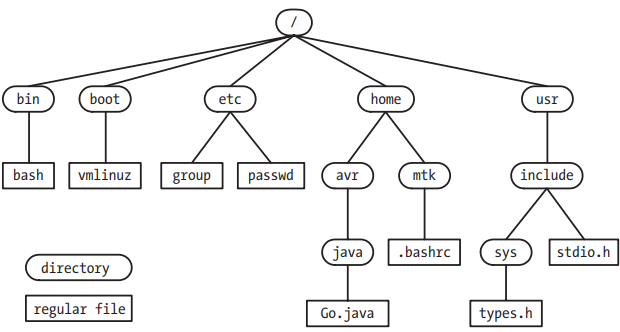
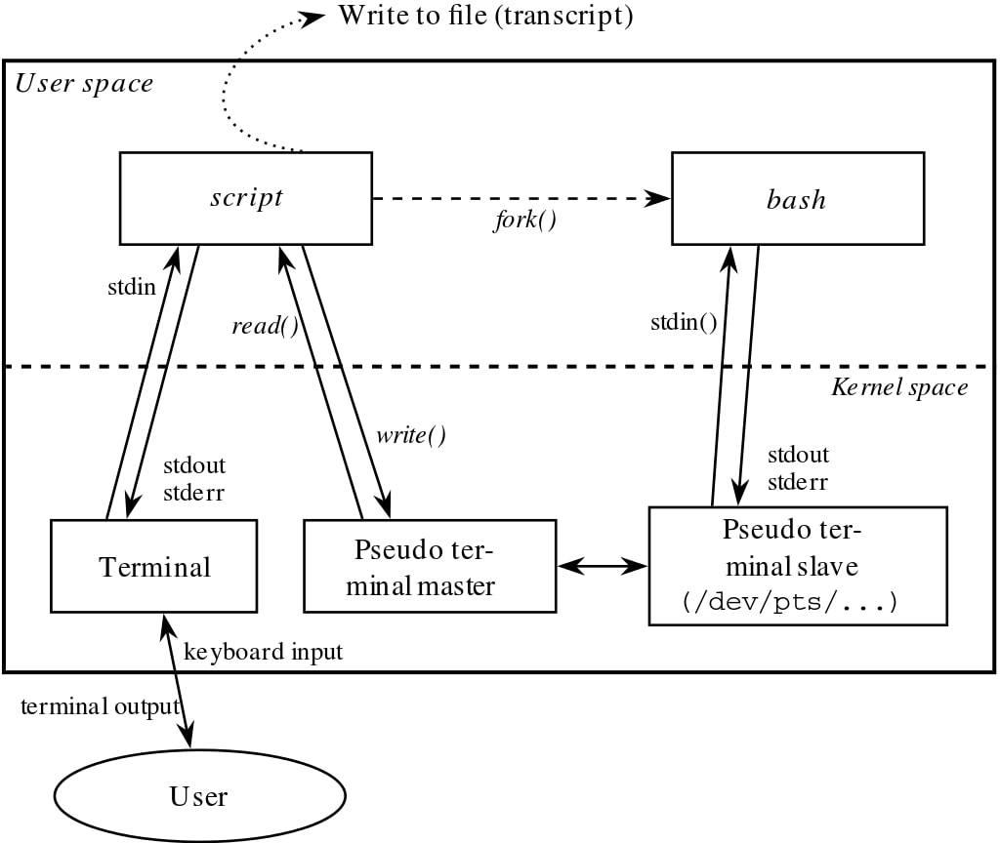

# Fundametnal Linux Concepts

This is a conceptual overview of topics that are covered more in depth later in the book.

## The Core Operating System: The Kernel

*Operating system* has two meanings
- The package consisting of the central software managing a computer's resources and all of the accompanying standard software tools (command-line interpreters, GUI, file utilities, editors, etc...)
- Specifically the central software that manages/allocates computer resources (i.e., the CPU, RAM and devices). This is also known as the *kernel*

While it is possible to run programs without a kernel, the kernel greatly simplifies writing/using programs by providing a software layer to manage it. 

The kernel executable is normally found at /boot/vmlinuz

### Kernel Tasks

- *Process scheduling* : a computer has 1+ CPUs which execute the instructions of programs. Linux is a *preemptive multitasking* OS. Multitasking means multiple processes can simultaneously reside in memory and receive use of the CPU. Preemptive means the rules governing which process receive use of the CPU is determined by the kernel process scheduler (rather than the process itself).
- *Memory management* : uses virtual memory management which allows process to be isolated from each other and from the kernel (one process can't read/modify the memory of another process or kernel) and only part of a process needs to be kept in memory which lowers the memory requirements. This allows more processes to be held in RAM leading to better CPU utilization (since a process is more likely to be ready to be run)
- *Provision of file system* : provides a file system on disk.
- *Creation and termination of processes* : can load a new program into memory, providing it with the resources it needs to run (CPU, memory, files, devices). It ensures the resources of finished process are freed.
- *Access to Devices* : devices (mice, monitor, keyboard, disk/tape drives, etc...) attached to a system allow communication between the computer and the outside world, permitting I/O. The kernel provides an interface to interact with these devices while arbitrating access to the devices.
- *Networking* : transmits/receives network packets on behalf of user processes.
- *Provision of a system call API*: Processes can request the kenrel to perform various tasks using kernel entry points known as system calls.

### Kernel mode and user mode

The CPU operates in at least two different modes: *user* and *kernel* mode (aka *supervisor* mode). Hardware instructions allow switching from one mode to another. Areas of virtual memory can be marked as either user space or kernel space. Exception is raised if CPU is accessing kernel space in user mode. Certain operations (ex halt instruction, initiating I/O operations, memory management, etc..) can only be executed while in kernel mode.

### Process vs. Kernel Views of the System

There are numerous processes running on a system. Executing processes have no idea when they will be scheduled/timed out. The delivery of signals and the occurence of interprocess communication are mediated by the kernel. A process doesn't know where it is located in RAM or if a particular part of its memory space is in RAM vs a swap area on disk. The process doesn't know where on disk the files it access are held. **A process itself can't directly communicate with other processes or I/O devices, create a new process or even end its own existence**. 

A running system has 1 kernel that controls everything described above a process itself can't do/know. The kernel maintains data structures  and executes operations that:
- contain info about all running processes. 
- translate filenames to physical locations on disk
- translate processes' virtual memory to phsyical memory
- start/ends/communicates between user space processes
- performs direct communication with I/O devices, transfering data between kernel and user space.

So when we say: "a process creates another process" we really mean, *"A process can request that the kernel creates another process"*

## The Shell

A *shell* is a program that reads commands either interactively typed by a user or within a shell script, and executes the appropriates program/s based on those commands. The term *login shell* is used to denote the process that is created to run a shell when the user first logs in.

Some OSs have the command interpreter (shell) as an integral part of the kernel. On UNIX systems, the shell is a user space process.

### Shell Types

- *Bourne shell (sh)* : Oldest widely used shell containing many familiar shell features: I/O redirection, pipelines, fielname globbing, variables, manipulation of env vars, command substitution, background command execution and functions.
- *C shell (csh)* : Name due to resemblance of many of the flow-control constructs in C language. Has more features, e.g. command history, command-line editing, job control and aliases.
- *Bourne again shell (bash)*: GNU's reimplementation of the Bourne shell supplying the features of Bourne and C shells. 

## Users and Groups

Each user on a system is uniquely identified, and users may belong to groups.

### Users

Every user has a login name (username) and numeric user ID (UID). They are defined by an entry in the system password file, /etc/passwd which includes the following additional info:
- Group ID: numeric group ID of the first of the groups of which the user is a member.
- Home directory: the initial directoy where the user is placed after logging in.
- Login shell: the name of the program to be executed to interpret user commands. 

The user's password is normally stored encrypted in the shadow password file, readable only by privileged users. 

### Groups

For controlling access to system resources, it's useful to organize users into groups. Each group is identified by a single line in the *group file* /etc/group which includes:
- Group name: the (unique) name of the group
- Group ID (GID): the numeric ID associated with this group.
- User list: comma-separated list of login names of users who are members of this group (not including the users who have this group ID as their group ID in their password file record)

### Superuser

Superuser has user ID 0 with login name root and bypasses all permission checks in the system.

## Single Directory Hierarchy, Directories, Links, and Files

The kernel maintains a single hierarchical directory structure to organize files (as opposed with operating systems such as Windows where each disk device has its own directory hierarchy). 



The term file is used to denote any file type. 

### Directories and links

A *directory* is a special file whose contents take the form of a table of filenames coupled with references to the corresponding files. The filename-plus-reference association is called a *link*. Files may have multiple links (therefore multiple names) within the system.

Every directory contains at least two entries: . (dot) a link to itself, and .. (dot-dot) a link to the parent directory. 

### Symbolic links

Like a normal link, a *symbolic link* provides an alternative name for a file. A normal link is a filename-plus-pointer in a directory list, whereas a symbolic link is a specially marked file containing the string of a name of another file, known as the target. So a symbolic link has a filename-plus-pointer entry in a directory for itself, and the contents of the file contains the target file string.

*hard link* and *soft link* are used as alternative terms for normal and symbolic links.

### Filenames and Pathnames

Filenames can be upt to 255 chars long. They can contain any characters except slashes and null characters (\0).The SUSv3 portable filename character set is [-._a-zA-Z0-9] and is recommended for filenaming.

A *pathname* is a string with an optional slash followed by a series of filenames separated by slashes.

### Current working directory

Each process has a *current working directory* within the single directory hierarchy. It's from this directory that relative pathnames are intepreted. A process inherits its current working directory from its parent process. A login shell has its current working directory set to the location named in the home directory field of the user's password file entry. A shell's cwd can be changed with the cd command.

### File ownership and permissions

Each file has an associated user ID and group ID that define the owner fo the file and the group which it belongs. For the purpose of accessing a file, a system divides users into three categories: the owner of the file, users who are members of the group matching the file's group, and the rest of the world (other). Read, write, and execute bits are attributed to each category. These can be attributed to a directory as well: read allows the files in the directory to be listed, write allows contents of the directory to be changed, execute (aka search) allows access to files within the directory. 

## File I/O Model

One of the distinguishing features of the I/O model on UNIX systems is the concept of *universality of I/O*. System calls such as *open(), read(), write(), close()* are used to perform I/O on all types files, **including devices**. (The kernel translates the application's I/O requests into appropriate file-system or device-driver operations that perform I/O on the target file/device).

The kernel essentially provides one file type: a sequential stream of bytes, which in the case of files,disks and tape devices can be randomly accessed. 

Many applications interpret the newline character (or linefeed) as terminating one line of text. When no data is returned from a read, the cursor is at the file's end.

### File Descriptors

The I/O system calls refer to open files using a *file descriptor*, a non-negative integer which is typically optained by the *open(str) -> file descriptor* system call.

When started by the shell, a process inherits 3 file descriptors: 0 as *stdin*, 1 as *stdout* and 2 as *stderr*. For a shell, these descriptors are connected to a terminal. In the stdio C library, they correspond to file streams *stdin, stdout,* and *stderr*.

### The stdio Library

In C, you use I/O functions in the C library (e.g, *fopen(), fclose(), scanf(), print(), fgets(), fputs()*) which are layered on top of the I/O system calls (*open(), close(),read(),write()...*)

## Programs

Can be source code or binary exe.

A filter is a program that reads its input from stdin, performs a transformation and writes it to stdout. This includes *cat,grep,tr,sort,wc,sed* and *awk*.

## Processes

When a program is executed, the kernel loads the code of the program to virtual memory, allocates space for program variables and sets up kernel bookkeeping data structures to record various information (process ID, termination status, user IDs and group IDs) about the process.

From kernel POV, processes are the entities among which the kernel must share the various resources of the computer. For resources that are limited (ex: memory), the kernel initially allocates some amount of the resource to the process, and adjusts this allocation over the lifetime of the process in response to the demands of the process and overall system demand for that resource.

### Process memory layout

Processes are logically divided into the following parts, known as *segments*:
- Text: instructions of the program
- Data: static variables used by the program
- Heap: area from which programs can dynamically allocate extra memory
- Stack: piece of memory for storing local function vars and function call linkage information that grows and shrinks as functions are called/return 

### Process creation and program execution

The processes can create new processes using *fork()* which create a new process with a copy of the parent's data, stack and heap. The new child process could continue executing functions in the same code as the parent or call *execve()* to load in a new program to execute. 

Each process has a process id (PID) and parent process id (PPID)

### Process termination status

Processes can terminate by either requesting its own termination with *exit()* and passing the *termination status* (a non negative integer) or receiving a signal to kill the process. A parent process can 

Either way a process is terminated, it yields a termination status which the parent process can inspect using the *wait()* system call. The termination status is either the value the child process passed to *exit()* or the value of signal.

If termination status == 0, the process succeeded.

Most shells make the termination status of the last executed program available with the env var $?

### Process user and group IDs (credentials)

Each process has a number of associated user IDs (UIDs) and group IDs (GIDs):

- *Real user/group ID* : the user and group to which the process belongs. New child processes inherit these IDs from its parent. A login shell gets its real user/group IDs from the corresponding fields in the system password file. 

- *Effective user/group ID* : these IDs are used in determining the permissions that the process has when accessing protected resources such as files and IPC objects. Typically these IDs are the same as the real IDs unless the process has assumed the privileges of another user/group.

- *Supplementary group IDs* : These IDs identify additional groups to which the process belongs (since a process can belong to multiple groups). The login shell gets its supplementary group IDs from teh system group file.

### Privileged processes

A privileged process is one whose *effective* UID is 0 (superuser). A process may be privileged if it was created by another privileged process (e.g., the login shell started by root (superuser)) OR if the process becomes privileged via the set-user-ID mechanism which allows a process to assume an effective UID of the UID of the program file that it is executing.

Privileges are divided into a set of distinct units called *capabilities* where each operation is associated with a particulary capability. A superuser process has all capabilities enabled while other processes can have a subset of them enabled. These capabilities are prefixed with CAP_, for example CAP_KILL.

### The *init* process

When booting the system, the kernel creates a special process called *init* (PID 1), the "parent of all processes" which is derived from the program file /sbin/init. It's main task is to create/monitor a range of required system processes.

All processes on the system are created (using fork()) by *init* or one of its descendants. It can't be killed, and only terminates when the system is shut down.

A *daemon* is a long-lived process that is often started at system boot and remains in existence until the system is shut down. It runs in the background and has no controlling terminal from which it can read/write. Examples include syslogd (records messages in system log) and httpd, which serves web pages via HTTP.

Each process has an *environment list*, a set of env variables maintained within the user-space memory of the process. New processes inherit the env list of the parent. When using exec() after forking a child, the child process can inherit the env list or get a new one (whatever is passed to exec()).

## Memory Mappings

The *mmap()* system call creates a new *memory mapping* in the calling process's virtual address space. It can be either:
- A *file mapping* maps a region of a file into virtual memory. Once mapped, the file's contents can be accessed by operations on the bytes in the corresponding memory region.
- An *anonymous mapping* doesn't have a corresponding file. Instead, the pages of the mapping are initialized to 0.

Memory mappings serve a variety of purposes, including initialization of a process’s text segment from the corresponding segment of an executable file, allocation of new (zero-filled) memory, file I/O (memory-mapped I/O), and interprocess communication (via a shared mapping).

## Static and Shared Libraries

An *object libary* is a file containing compiled object code for a set of functions (normally logically related) that may be called by programs. 

- *Static Libs* aka *archives* : a structured bundled of compiled object modules. To use these functions, we specify that library in the link command when building a program. After the linker resolves the various function references in the main program, it extracts copies of the required object modules from the library and copies them into the resulting exe file. We say that program is *statically linked*. **Cons** it wastes disk space since every exe using these functions are duplicated. Furthermore, when the library functions are modified and recompiled, all the applications using them need to be relinked
- *Shared Libs* : instead of copying object modules into the exe, the linker just writes a record into the exe to indicate that at run time, the executable needs to use that shared lib. When the exe is loaded into memory, a program called the *dynamic linker* ensures that the shared libraries required by the exe are loaded into memory, and performs run-time linking to resolve the function calls in the exe. The solves the cons of static libs.

## Interprocess Communication and Synchronization

- *signals* : indicate an event has occured
- *pipes* ( | ) aka *FIFOs*: transfer date between processes
- *sockets* : transfer date from one process to another on the same or different systems
- *file locking* : allows a process to lock regions of a file so other processes don't read/update its contents
- *message queues* : exchange messages (packets of data) between processes
- *semaphores* : which are used to synchronize actions of processes
- *shared memory* : allow 2+ processes to share a piece of memory. Each process can immediatley view the changes of within it

**NOTE**: Some of these IPC have overlapping functionality (FIFO vs domain socket) due to UNIX history (System V vs BSD)

## Signals

While being an IPC, signals employed in other ways as well. They are described as *"software interrupts"* allowing processes to react to some event that has occured. They can react by either:
- ignoring the signal
- being killed
- being suspended until later being resumed by receipt of a special-purpose signal.

Signals are sent to a process by the kernel, another process (with suitable permissions) or by the process itself. These signals are identified by a unique integer and a symbolic name SIXxxx.

For example, the kernel may send a signal to a process when:
- the user types control-C (*interrupt*) on the keyboard
- one of the process's children has terminated
- a timer set by the process has expired
- the process attempted to access an invalid memory address

The shell *kill* command can be used to send a signal to a process. 

*Signal handlers* can be programmed to react specifically to certain signals (especially used to ignore certain ones).

The interval between the time a signal is generated and the time it is delivered, a signal is said to be *pending* for a process. Normally, a pending signal is delivered as soon as the receiving process is next scheduled to run or immediately if the process is already running. A process can *block* a signal by ading it to the process's *signal mask*.

## Threads

Each process can have multiple threads of execution. You can think of threads as a set of processes that share the samevirtual memory as well as a range of other attributes. Each thread however has its own call stack. 

They can communicate with each other via global variables that they share. The threading API provides *condition variables* and *mutexes*, which are primitives that enable the threads of a process to communicate and synchronize their actions. 

## Process Groups and Shell Job Control

Each program executed by the shell is started in a new process. Three process are created for the following:

```bash
ls -l | sort -k5n | less
```

Most shells provide *job control* which allows the user to execute multiple commands or pipelines simultaneiously. All processes in a pipeline are placed in a new *process group* or *job*. Each process in a process group has the same integer *process group ID* which is the same as the process ID of one of the processes in the group, termed the *proces group leader*.

## Sessions, Controlling Terminals, and Controlling Processes

A *session* is a collection of process groups (jobs), all the processes having the same *session id*. A session has a *controlling terminal* which is established when the *session leader* (the process that created the session where its PID becomes the session id) opens a terminal device. For a session created by an interactive shell, this is the terminal which the user logged in. A terminal can be the controlling terminal of at most one session.

As a consequence of opening the controlling terminal, the session leader becomes the *controlling process* for the terminal. The controlling process receives a SIGHUP signal if a terminal disconnect occurs (e.g, the terminal window is closed)

At any time, one and only one process group is the *foreground process group* while unlimited background process groups can be around (execute a command in the background by appending a &). If a interrupt (Control-C) or suspend (Control-Z) is typed by user on controlling terminal, the terminal driver sends a signal that kills/suspends the foreground process group.

## Pseudoterminals

A *pseudoterminal* is a pair of connected virtual devices, known as *master* and *slave*.



## /proc File System

Linux provides a /proc directory which is a virtual file system that provides an interface to kernel data structures in a form that looks like files and directories on a file system. This provides an easy mechanism for anyone/ any script that wants to obtain info about specific processes (/proc/PID) and modify the info. 