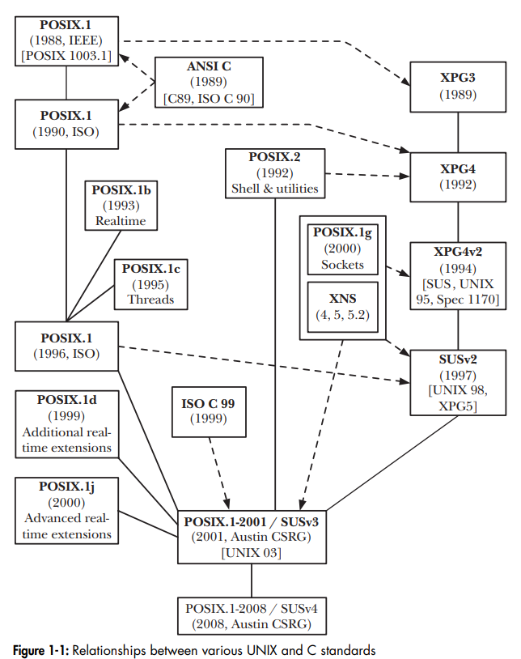

# Brief History of UNIX and C

First unix implementation devloped in 1969 by Ken Thopmson at Bell Labs (division of AT&T). Thompson drew several ideas from a previous operating system project MULTICS (where UNIX derived its name). These ideas included a tree-structured file system, a separate program for interpreting commands (the shell) and the notion of files as unstructured streams of bytes.

In 1970, Dennis Ritchie, a Bell Lab colleague of Thompson, designed the C language and by 1973, the UNIX kernel could be almost entirely rewritten in it. UNIX became on of the earliest operating systems to be written in a high-level language (which made porting to other hardware architectures possible).

By 1975, the 6th edition of UNIX started to become widely used oustide of AT&T. At the time, AT&T had a government sanctioned monopoly of US the telephone system, and the terms of it prevented it from selling UNIX as a software product. AT&T began distributing for use at universities inclduing docs and kernel source code (10,000 lines at the time). 

## Birth of BSD and System V

The 7th edition, UNIX diverged into two variants: BSD and System V.

Thompson was a visiting professor at Berkley from 75/76. Him and some grad students added tools (C shell, vi, improved file system...) and released it under the name Berkley Software Distribution (BSD). In 1983, 4.2BSED contained a complete TCP/IP implementation (which was significant). 

Meanwhile, AT&T was forced to breakup its monopoly by US antitrust legislation allowing them to market UNIX. This led to the release of System V in 1983. Many other companies marketed their own version of including Sun's SunOS (later Solaris), HP's HP-UX, and Apple's A/UX.

# Brief History of Linux

Linux is commonly used to refer to the entire UNIX-like OS of which the Linux kernel forms a part. However, many of the key components contained within a typical commercial Linux distribution originate from a project predating Linux, GNU.

## The GNU (GNU Not Unix) Project

In 1984 Richard Stallman started the GNU project to develop an UNIX-like system consisting of a kernel and all associated software packages. It would be free to modify and redistribute the software (specified in the Stallman's creation of *General Public License* )

The GNU project did not initially produce a working UNIX kernel, but it did create a range of programs that could be run on UNIX-like operating systems (like Emacs, gcc compiler (GNU Compiler collection), bash and glibc (GNU C library)). By the early 90's, GNU project still were missing one componenet: a working UNIX kernel.

## Linux Kernel and Distributions

In 1991, Linus Torvalds, inspired by the Minix OS, set out to create a new UNIX kernel. With the help of the developer community, Linux 1.0 was released in March 1994. 

In the early days of linux, the user had to assemble all of tools and libraries, create a file system and correctly place and configure all of the software on that fiel system. Distributors created Linux packages (distributions) that automated the installation process (creating file system and installing kernel). 

Side note: Since C was implemented on a wide variety of UNIX systems, and with the standardization of the C language (ANSI C aka C89) it made programs written with the standard C library portable to any unix system.

## POSIX (Portable Operating System Interface) and SUS (Single Unix Specification)

POSIX (created by IEEE) is an evolving specification that documents an API for a set of services that should be made available to a program by a conforming operating system.

POSIX is based on the UNIX system call and the C library function API, but any operating system (non-Unix too) can implement this interface without having to change the underlying OS. 

POSIX standardized the shell and other UNIX utilities, as well as the APIs for threads, networking, sockets, file synchronization, async I/O, process scheduling, clocks/timers, and IPC.

X/Open Group created the X/Open Portability Guide (XPG) soon to be repackaged as SUS which is a superset of the POSIX standards. SUSv3 is also known as X/Open System Interface (another common standard) 

## Linux Standards, Linux Standard Base (LSB)

Linux is near-conformant to POSIX and SUS. It isn't branded as UNIX by the Open Group due to the time/expense of getting certified for it for each Linux distribution.

With most commercial UNIX implementations (and Windows), the same company both develops and distributes the OS. With Linux, the implementation is separate from distribution and multiple orgs (commercial and non-commercial) handle Linux distro.

Linus Torvalds doesn't endorse a particular Linux distribution, but other developers carrying out Linux/GNU development and other open source software are employed by companies (IBM and HP) with strong interest in Linux. 

There is no *standard* commercial Linux. Each distributor's kernel offering is based on a snapshot of the mainline (Torvald's) kernel at a point in time, with a number of patches applied. These patches are intended to be commercially desirable, making competitive differentiation between distros.

The Linux Standard Base (LSB) ensures binary applications can run on any LSB-conformant system. This is different than the POSIX C source code compatability where any source code can be compiled on another system. Binary portability is more demanding.

