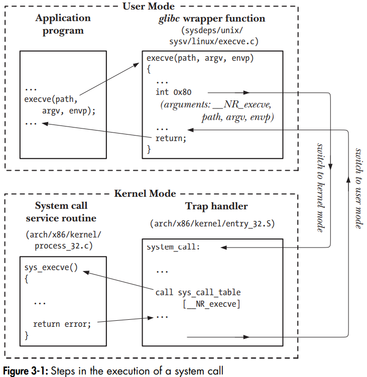

# System Programming Concepts

## System Calls

A *system call* is a controlled API entry point into the kernel, allowing a process to request the kernel perform some action on the process's behalf. For example, a system call is used to create a new process, perform I/O, create an IPC pipe, etc...

There are only a set number of system calls (each one with a unique id number). A system call changes the process state from user mode to kernel mode allowing the CPU to access protected kernel memory. Each system call may have a set of arguments that specify info to be transferred from user space (the process's virtual address space) to the kernel space (and vice versa).

### Execution of System Call

From a programming POV, invoking a system call looks like calling a C function. For an x86-32 system

1. A program makes a system call by invoking a wrapper function in the C library.
2. The wrapper function receives these arguments via the stack, but the kernel expects them in specific registers. The wrapper function copies the args to these registers.
3. Since all system calls enter the kernel the same way, the kernel needs a method of identifying the system call. This is done by copying the system call number into CPU register %eax
4. The wrapper executes a *trap* machine instruction (int 0x80), which causes the processor to switch from user to kernel mode and execute code pointed to by location 0x80 (decimal 128) of the system's *trap vector*.
5. The kernel invokes its *system_call()* routine (located in arch/i386/entry.S) to handle the trap. This handler:
    
    1. Saves register values onto the kernel stack
    2. Checks validity of the system call number
    3. Invokes the given system call service routine by indexing into the table (the *syst_call_table* kernel variable).
    4. Checks the validity of any args passed to it (e.g., it checks addresses point to valid locations in user memory)
    5. Performs system call task which may involve modifying values at addresses specified in the given args and transferring data between user memory and kernel memory (I/O operations). Finally, it returns a result status.
    6. Restores register values from the kernel stack and places the system call retrun value on the stack of the wrapper function.
    7. Returns to the wrapper function, sumultaneously returning the processor to user mode.
6. If the return value of the system call service routine indicated an error, the wrapper function sets the global variable errno using this value. The wrapper function the nreturns to the caller, providing an integer status return value.

From the point of view of a C program, calling the C library wrapper function is synonymous with invoking the corresponding system call service routine. Normally the C library function is name xxx and the system call within the kernel code is sys_xxx.

## The Standard C Library; The GNU C Library

Some C library functions are thin wrappers for the system call. Some provide extra functionality to a system call, for instance printf() provides formatting/buffering, and uses the *write()* system call that just outputs a block of bytes. Some library functions don't call any system calls (ex: string manipulation).
