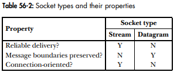

# Sockets

*Chapter 56*

In typical client-server scenarios, applications communicate using sockets as follows:
- Each application creates a socket. A socet is the "apparatus" that allows communication, and both applications require one.
- The server binds its socket to a well-known address (name) so that clients can locate it 
 
 A socket is created using the *socket()* system call which returns a file descriptor:

```C
fd = socket(domain, type, protocol);
```

## Communication Domains

Sockets exist in *communication domains* which determines:
- the method of identifying a socket (i.e., the format of the socket "address")
- the range of communications (applications on the same host, or hosts connected over a network)

The following domains exist:


## Socket types

Every sockets implementation provides at least two types of sockets: stream or datagram. 



- *Reliable* means that we are guarenteed the transmitted data will arrive intact exactly as it was transmitted or we will receive notification of an error.
- *Bidirectional* means that data may be transmitted in either direction between two sockets
