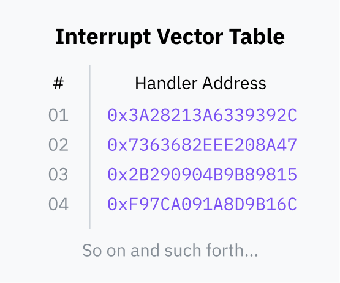

# What Even is a Syscall?

The current privilege level (CPL) determines whether a process is executing
in user space or kernel space. This level is indicated in the last 2 bits of
the cs (code segment) register.

## Software interrupt

**Software interrupts**, a featuer of the processor, are used to initiate transfer from user space to kernel space.

During the boot process, the OS stores an *interrupt vector table* (IVT) in RAM and registers it w/ the CPU. It maps interrupt numbers to handler code pointers.

Now a userland program can use an INT instruction which tells the processor to look up the given interrupt number in the IVT, switch to kernel mode then jump the instruction pointer to the memory address stored in the IVT. The userland program moves any arguments to be passed to the syscall to specific registers (or on sthe stack depending on the architecture). This movement of data is done by higher-level library functiosn that wrap the necessary assembly instructions (libc). Calls to the libc function itself doesn't trigger a switch to kernel mode, they're just standard function calls, but assembly code within the function transfers control to the kernel.

Once the kernel code finishes, it uses an instruction like IRET to tell the CPU to switch back to user mode and return the instruction pointer to where it was when the interrupt was triggered.

For instance the interrupt ID for system calls on Linux is 0x80

So software interrupts are safe because the processor has been configured by the OS with where in the OS code to jump to. 

