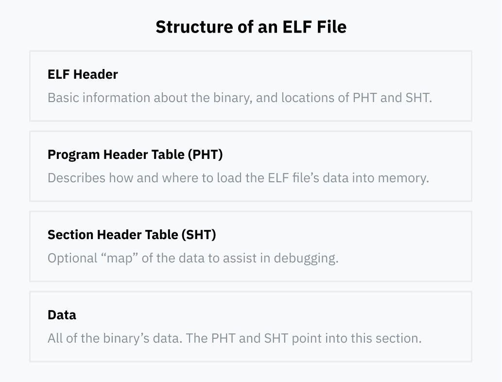
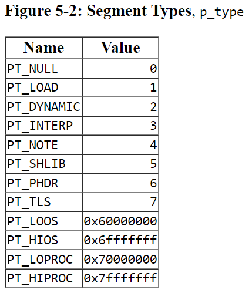
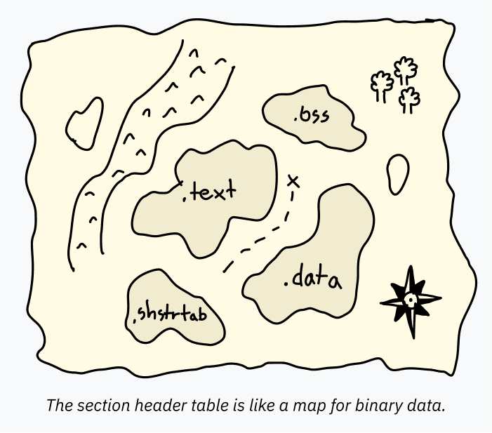
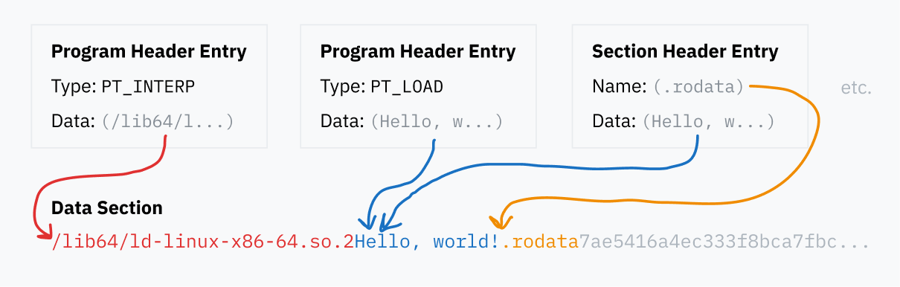

# ELF (Executable and Linkable Format) binary file format 

This type of file is executed using the binfmt_elf handler which is far more complex than the other handlers.

## ELF File Structure 



### ELF Header
Specifies:
- Processor type (i.e. instruction set)
- Whether the binary is an executable or a dynamically linked library
- Entry point of the executable (address of first instruction)
- The location of the program header table and section header (which can be anywhere in the file)

### Program Header Table

An array of structs containing details for how to load and execute the binary at runtime. (See https://refspecs.linuxbase.org/elf/gabi4+/ch5.pheader.html for more info)

```c
typedef struct {
	Elf32_Word	p_type;
	Elf32_Off	p_offset;
	Elf32_Addr	p_vaddr;
	Elf32_Addr	p_paddr;
	Elf32_Word	p_filesz;
	Elf32_Word	p_memsz;
	Elf32_Word	p_flags;
	Elf32_Word	p_align;
} Elf32_Phdr;
```
#### Overview 
Each struct specifies info about:
- the position of its data within the ELF file
- the virtual memory address the data should be loaded into memory at (blank if not to be loaded)
- two fields about the length of the data, one for the length of the data in file, one for the length of the memory region. If the memory region length is longer than the length in the file, the extra memory is filled with zeros and used as a static memory location during runtime. This is known as a BSS (.bss)
- a flags field used to specify the permissions loaded into memory: **PF_R** (readable), **PF_W** makes it writable, and **PF_X** means it's code that should be allowed to execute on the CPU


#### p_type

 p_type: This member tells what kind of segment this array element describes or how to interpret the array element's information. Common type values and their meanings appear below: 
 
    - PT_LOAD : Data to be loaded into memory
    - PT_NOTE : Free form text like copyright notices and verisons
    - PT_DYNAMIC : Info about dynamic linking
    - PT_INTERP : Path to the location of an "ELF interpreter"

#### Other struct fields

- p_offset: This member gives the offset from the beginning of the file at which the first byte of the segment resides.
- p_vaddr: This member gives the virtual address at which the first byte of the segment resides in memory.
- p_paddr: On systems for which physical addressing is relevant, this member is reserved for the segment's physical address. Because System V ignores physical addressing for application programs, this member has unspecified contents for executable files and shared objects.
- p_filesz: This member gives the number of bytes in the file image of the segment; it may be zero.
- p_memsz: This member gives the number of bytes in the memory image of the segment; it may be zero.
- p_flags: This member gives flags relevant to the segment. Defined flag values appear below.
- p_align: As ``Program Loading'' describes in this chapter of the processor supplement, loadable process segments must have congruent values for p_vaddr and p_offset, modulo the page size. This member gives the value to which the segments are aligned in memory and in the file. Values 0 and 1 mean no alignment is required. Otherwise, p_align should be a positive, integral power of 2, and p_vaddr should equal p_offset, modulo p_align.

### Section Header Table

Series of structs containing info about the data iwthin an ELF file (like a map). The Program Header specifies a large swatch of data to be loaded into memory together with a single PT_LOAD, but this might contain both code and global variables! The CPU itself doesn't care, it just starts executing instructions starting at the entry instruction address, but debuggers need to know where sections of data start and end (.text vs .data). **This means a Section Header table is not necessary to execute a program** In fact some intentially leave it out to make their program harder to decode.

- .text: machine code to be loaded into memory and executed on the CPU
- .data: initialized data hardcoded in the executable to be loadedi into memory (e.g. a global variable containing some text might be in this section)
- .bss: common to have some allocated memory that starts out zeroed and is reserved for unititialized/zero-initialized variables which helps save space since these zeroed values aren't to be stored in the ELF file itself. Memory for these variables can then be allocated at runtime.
- .rodata: .data for read only vars (for instance hard coded strings e.g. "Hello world" in printf("Hello world"))
- .shstrtab: in order to keep each entry section header the same size, the type of section (or section name like .text, .data etc...) is contained in this table based on an offset into it. So the section specfies a fixed offset, and the table contains the name of it.



### Data

The program and section header table entries point to blocks of data within ELF file, whether to load them into memory, specify where program code is or just to name sections. All these different pieces of data are contained in the data section of the ELF file.




### Linking

The kernel, specifically the *binfmt_elf* handler that is run, cares about two types of entries in the program header table:

*PT_LOAD* : specifies where the program data (like .text, .data, .rodata) need to be loaded in memory

*PT_INTERP* : specifies which "dynamic linking runtime". The program will contain a reference to a shared library, a file with the *.so* (Shared Object) extension. These file types contain a *.dynsym* section in the section header table which contains info on what symbols are exported from the file and can be dynamically linked to.

NOTE: A static linking loads only the portions of library used are included in memory while dynamic linking loads the entire library into memory. This allows the OS to actually save more space by loading a library into memory once and then sharing that code between processes.

### Execution

If the binary is dynamically linked, the OS can't just jump to the binary's code right away because there would be missing code. The OS needs to figure out what libs are used, load them, replace all named pointers with actual jump instruction and then start the actual program code. 

This is very complex code that is usually a standalone program rather than part of the kernel. ELF files specify the path to the program they want to use in a PT_INTERP entry (typically /lib64/ld-linux-x86-64.so.2). 

Steps (remember all this logic is within the execve syscall code):
- (stores current value of registers to be restored when switching back to user space)
- Kernel reads the ELF header and scans through the program header table
- It loads all PT_LOAD segments into memory, populating the program's static data, .bss space, and machine code.
- If the program is dynamically linked, the kernel executes the ELF interpreter (PT_INTERP), so it loads the interpreter's data, BSS, and code into memory.
- Now the kernel needs to set the instruction pointer for the CPU to restore when returning to userland. If the exe is dynamically linked, the kernel sets the instruction pointer to the start of the ELF interpreter's code in memory. Otherwise, the kernel sets it to the start of the executable.
- The kernel pushes the argc, argv, and env variables to the stack for the program to read when it begins.
- Clears registers and returns to userland, and the CPU jumps to the stored instruction pointer (which is either the ELF interpreter or the first line of the program)