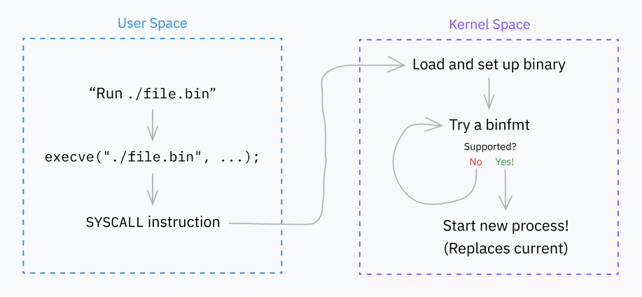

source : https://cpu.land/how-to-run-a-program
# Basic Behavior of Exec Syscalls



The *execve* (and other flavors) syscall executes a binary program. The v stands for vector (aka list) of arguments and the e stands for the list of environment variables (envp).

The call signature:
```c
int execve(const char *filename, char *const argv[], char *const envp[]);
```

This is how execve is defined:

```c
SYSCALL_DEFINE3(execve,
		const char __user *, filename,
		const char __user *const __user *, argv,
		const char __user *const __user *, envp)
{
	return do_execve(getname(filename), argv, envp);
}
```

It uses a macro (for some security reason) that specifies the number of arguments to pass the syscall (3 in this case). This is the standard way to define syscalls in Linux.

*getname()* function copies the string from user space to kernel space and does some usage tracking. It returns a filename struct which is defined below:

```c
struct filename {
	const char		*name;	/* pointer to actual string */
	const __user char	*uptr;	/* original userland pointer */
	int			refcnt;
	struct audit_names	*aname;
	const char		iname[];
};
```

Then do_execve() is called which sets default params to do_execveat_common as seen below:

```c
static int do_execve(struct filename *filename,
	const char __user *const __user *__argv,
	const char __user *const __user *__envp)
{
	struct user_arg_ptr argv = { .ptr.native = __argv };
	struct user_arg_ptr envp = { .ptr.native = __envp };
	return do_execveat_common(AT_FDCWD, filename, argv, envp, 0);
}

static int do_execveat(int fd, struct filename *filename,
		const char __user *const __user *__argv,
		const char __user *const __user *__envp,
		int flags)
{
	struct user_arg_ptr argv = { .ptr.native = __argv };
	struct user_arg_ptr envp = { .ptr.native = __envp };

	return do_execveat_common(fd, filename, argv, envp, flags);
}
```

AT_FDCWD is a file descriptor (simply an int) that tells functions to interpret pathnames as relative to the current working directory.

## Steps to Executing the Program

### Step 1: Setup

do_execveat_common() is the core function handling program execution!

The first major step is setting up a large struct called **linux_binprm** (linux binary program):
- mm_struct and vmp_area_struct are defined to prepare virtual memory management
- arcg and envc are calculated and stored to be passed to the program\
- filename and interp store the filename of the program and its interpreter. These start out equal but can change in some cases for instance a *python filename.py* would have interpreter = python.exe and filename = filename.py 
- buf is an array filled with first 256 bytes to be executed. It's used to detect file format and load script shebangs

### Step 2: Binfmts

The kernel's next job is to iterate through binary format handlers (defined in fs/binfmt_elf.c) that takes a the linux_binprm struct as an arg. These attempt to decode/find magic numbers in the buf and check the file extension. If the given handler supports it, it prepares the program for execution and returns a success code. Otherwise the next handler is tried.

#### Format Highlight: Scripts

The handler *binfmt_script*. It checks if a file starts with a shebang **!#**. For example *#!/bin/bash*

If the file starts with it, the binfmt handler then reads the interpreter path along with any args (it stops once a "\n" is hit).

#### But my shell script still executes without a !#

That's due to the shell itself. If you execute a shell script with the exec syscall, and it fails, most shells retry executing the file as a shell script by executing a shell with the filename as the first argument.

So for example, a script called hello.sh like:

hello.sh
```bash
echo hello
```

shell
```bash
./hello.sh
```

This will fail, but the shell then reruns it as 
```bash
/bin/bash hello.sh
```

(which is what the execve syscall would do under the hood anyways by finding the interpreter path then executing the interpreter program with the file as an arg).


