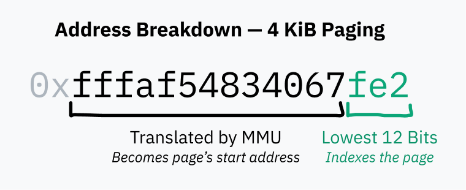
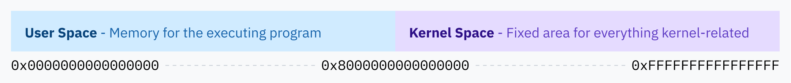
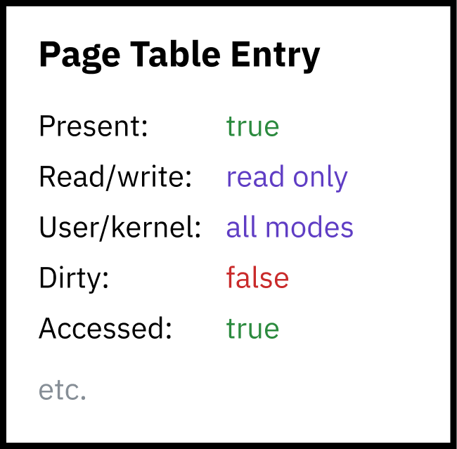
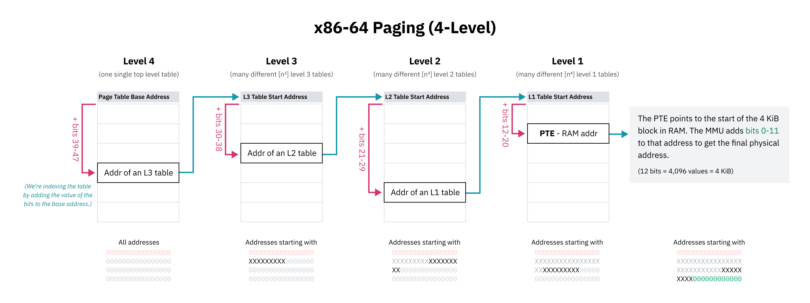

# Memory Management

When the computer first boots up, memory accesses go directly to physical RAM, but after startup, the OS creates the translation dictionary and thells the CPU to start using the *memory management unit* (MMU). 

This translation dictionary is known as a *page table* and translating every memory access is called *paging*. Each entry in a page table, known as a *page*, represents how a certain chunk of virtual memory maps to RAM. They are always of a fixed size determined by the processor architecture (default being 4 KiB, 2^12).

Therefore, the bottom 12 bits of a virtual address indexes into the page table.

The page table itself resides in RAM and while it contains millions of entries, each entry'y size is only a couple of bytes. The kernel first constructs the page table in RAM, then stores the physical address of the start of the table in a register called the *page table base register (PTBR)*. Finally, the kernel enables paging to translate memory access with the MMU. 

This is how processes have their own isolated memory space - when the OS switches context from one to another, the OS remaps the virtual memory space to a different area in physical memory. 

## Security with Paging

Simply put, processes can't access memory of other processes due to the virtualization of page tables.

For kernel memory, since it stores plenty of data of its own for processes and the page table itself, the kernel itself needs to access this memory (due to either a software/hardware interrupt or syscall). Linux solves this by allocating the top half of the virtual memory space to the kernel.

But userland processes should never be able to access this memory directly! So paging enables a second layer of security: each page must specify permission flags.

The page has flags for specifying
- Read/write access
- Kernel only access

So the entire kernel memory space is available in the virtual memory mapping for user space programs, they just don't have permission to access it.

So when an interrupt takes place, the CPU switches the privilege level to kernel mode and jumps to the kernel handler code where the kernel code can now access the upper half of virtual memory. It can then write to the page tables to remap the lower half of virtual memory for the new process, set up a new location for an instruction pointer, then switch back to usermode and you have an entirely new process executing.

In short, this means that kernel code also uses the MMU! All pointers to kernel space data/code are virtual addresses.

## Hierarchical Paging

Hierarchical paging systems have multiple levels of page tables of increasingly small granularity. The top level entries cover the large blocks of memory and point to page tables of smaller blocks, creating a tree structure. The individual entries for blocks of 4 KiB or whatever the page size is are the leaves of the tree.

This tree data structure is used to mitigate storing an entry for the entire address space (which would be memory intensive). Instead, we store only the ones defined with a non-null pointer (any entries within the levels of the tree with a null pointer would have all descedant entries omitted, and therefore not stored in RAM)

The tree structure also has the benefit of the kernel keeping lower level page tables stored in memory exactly as they are and they simply swap the pointers of the top level table when entering the tab

The first 16 bits are skipped, so the address space is really 48^2 (128 TB) not 64^2 (therefore, for the diagram above, kernel space really starts at the midpoint for 48^2).

On the OS level, it’s advantageous for the virtual address space to be larger than the physical address space. As Linus Torvalds said, “[i]t needs to be bigger, by a factor of at least two, and that’s quite frankly pushing it, and you’re much better off having a factor of ten or more. Anybody who doesn’t get that is a moron. End of discussion.”

## Swapping and Demand Paging

A memory access can fail because:
- the address is out of range
- it might not be mapped by the page table
- it might have a page entry marked as not present

This causes an MMU to trigger a hardware interrupt called a *page fault*. If the read was truly invalid/prohibited, a seg fault (core dumped) occurs. 

Memory accesses can intentialy fail, allowing the OS to populate the memory and then *hand control back to the CPU to try again*. For example, the OS can map a file on disk to virtual memory without actually loading it into RAM, then load it into physical memory when the address is requested and a page fault occurs. This is called *demand paging*.

Demand paging also enables the technique that you’ve probably seen under the name “swapping” or “paging.” Operating systems can free up physical memory by writing memory pages to disk and then removing them from physical memory but keeping them in virtual memory with the present flag set to 0. If that virtual memory is read, the OS can then restore the memory from disk to RAM and set the present flag back to 1.

