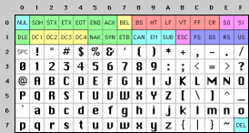
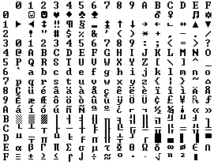
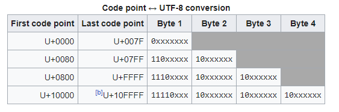
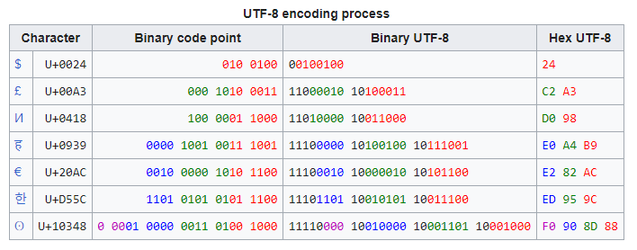
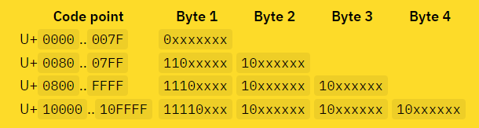

# Character Sets and Unicode

Notes from https://www.joelonsoftware.com/2003/10/08/the-absolute-minimum-every-software-developer-absolutely-positively-must-know-about-unicode-and-character-sets-no-excuses/

Additional Notes from https://tonsky.me/blog/unicode/

## Ascii

Ascii is a character set that maps a number between 0 and 127 (7 bits) to english letters, digits punctuation, special characters and control characters.

Example: Space is 32, and "A" is 65.



Codes below 32 are unprintable control characters, like 7 makes your computer beep.

## OEM Character sets

Since there was an extra bit that Ascii didn't use (128 to 255), many got the idea to create their own character sets that included accented/foreign letters and other formatting characters. The IBM-PC created the OEM character set which led to many others creating OEM sets with different mappings for the upper 128 characters.

This image represents the original IBM-PC OEM character set (with lots of line drawing characters for creating tables)



This led to a free-for-all where character sets between different countries (with different alphabets and special characters) were not cleanly mapped between each other. For instance if an american wanted to send their résumé to Israel, the character code 130 would display as é, but on computers sold in Israel it was the Hebrew letter Gimel (ג) leading to a perceived file name in Israel being  rגsumגs.

## ANSI

The ANSI standard codified the OEM free-for-all. Everyone agreed on the bottom 128 (ascii characters) but <i>code pages</i> would help standardize the top 128 characters. So for example in Israel DOS used a code page called 862, while Greek users used 737. MS-DOS had dozens of these code pages to deal with different languages. 

Asian languages needed much more than 8 bits to represents the thousands of letters in their alphabet. This was solved with the messy <i>double byte character set</i> in which some letters were stored in one byte and others two. This made traversing strings programmatically much more difficult since you could go forwards fine (you always know if you're at the beginning of a word) but couldn't go backwards without added complexity. 

## Unicode 

Unicode is a single character set that includes every reasonable writing system (even Klingon). It has a different way of thinking about characters.

Up until now, we assumed characters sets map a letter to a number.

A -> 0100 0001

In Unicode, a letter maps to something called a <i>code point</i> which is still a theoretical concept (how it's represented in memory is another story).

So the letter A is different than a, but not different that <b>A</b> or <i>A</i> (or any other font for A). 

Every letter in every alphabet is assigned a magic number by the Unicode consortium which is written like U+0639 (a code point) U+ for unicode and a hex.

## Encodings (UCS-2 or UTF-16)

OK, so say we have a string:

<b>Hello</b>

which, in Unicode, corresponds to these five code points:

U+0048 U+0065 U+006C U+006C U+006F.

Just a bunch of code points. Numbers, really. We haven’t yet said anything about how to store this in memory or represent it in an email message.

The earliest idea for Unicode encoding(UTF-16), which led to the myth about the two bytes, was, hey, let’s just store those numbers in two bytes each. So Hello becomes

00 48 00 65 00 6C 00 6C 00 6F

Right? Not so fast! Couldn’t it also be (due to big vs little endian):

48 00 65 00 6C 00 6C 00 6F 00 ?

### (Personal note) Aside on Endianess

Endianess doesn't have to do with the bit ordering within a byte, it has to do with the byte ordering within a multi-byte datatype. Since ASCII characters are a single byte, they are represented the same regardless of CPU. Above, with UTF-16, we need two bytes to store a unicode character. So, for instance:

H (U+0048) can be represented by the number 72 but in memory it can be 0000 0000 0100 1000 (which is big endian since it stores the ) 

So you would need a special U+FEFF to signify the endianess (FE FF -> big endian / FF FE -> little endian). Furthermore, it would be very wasteful to encode the most used ascii characters with two bytes. 

## UTF-8

UTF-8 is a way of storing a string of Unicode code points in memory using single bytes. Every code point from 0-127 are stored in a single byte just like ASCII (so Americans notice no difference between UTF-8 encoding and the ASCII character set encoding). 

Code points above 128 need to be stored using up to 4 bytes! The number of bytes depends on the Unicode code point value:



So since ASCII characters always start with a 0, it's exactly the same as UTF-8.



So you can encode the Unicode character set with any encoding (ASCII, any OEM encoding) with the caveat that not all unicode code points will be rendered correctly and you'll be left with a ? when it can't. UTF 7,8,16 and 32 have the nice property of being able to store any code point correctly.

# MOST IMPORTANT FACT

<b><u>There's No Such Thing As Plain Text</u></b>

If you have a string of bits, you have to know what encoding it is to display it correctly to users

There are over 100 encodings, so above code point 127, all bets are off. 

# How do we indicate what encoding a string uses?

For email message, include <b> Content-Type: text/plain;charset="UTF-8" </b>

Web pages are more difficult because a web server could host lots of sites with hundreds of pages contributed by people in different languages using different encodings. So in order to know the encodings, it's in the HTML document. This only works because <b> almost every encodings does the same thing with characters between 32 and 127.</b> 

So you can always write this without using non-ascii letters:

```html
<html>
<head>
<meta http-equiv="Content-Type" content="text/html; charset=utf-8">
```

It's best the meta tag is the first tag in head because once it figures out the encoding, it restarts from the top using that encoding.

# Back to UTF-8



So ASCII can be encoded normally in UTF-8 since we know all bytes starting with a zero will be a sinle byte ASCII character. So U+0000 to U+007F (01111111)

I thought that the prefix *"10"* would be used to indicate 2 byte long characters but this is actually reserved for intermediate bytes. This is to know when parsing a string whether you're at the start of a encoded character. So if a program begins to parse a character, and it notices it starts with *10*, then it knows it must move the cursor forward or backward to find a character beginning.

So each byte class has a specific bit prefix to know how many bytes to check for it.

Important points:
- You CAN’T determine the length of the string by counting bytes.
- You CAN’T randomly jump into the middle of the string and start reading.
- You CAN’T get a substring by cutting at arbitrary byte offsets. You might cut off part of the character.

Those who do will eventually meet this bad boy: � (U+FFFD)

## Wouldn't UTF-32 be easier for everything?

If every code point is always 4 bytes then *strlen(s) == sizeof(s) / 4, substring(0, 3) == bytes[0, 12], etc.*

The problem is a single code point is not always a characters. Some have mutliple code points, known as *extended grapheme clusters* or *graphemes for short*

- é is U+0065 + U+0301
- 각 (Korean) is U+1100 U+1161 U+11A8
- ☹️ is U+2639 + U+FE0F
- 👨 is U+1F468 + U+200D + U+1F3ED
- y̖̠͍̘͇͗̏̽̎͞ is U+0079 + U+0316 + U+0320 + U+034D + U+0318 + U+0347 + U+0357 + U+030F + U+033D + U+030E + U+035E

There's no limit
## What's  🤦🏼‍♂️.length()

Different programming languages will give different answers. Python says 5, Javascript/Java/C# 7, Rust 17. It depends on the internal string representations (UTF-32, UTF-16, UTF-8) and report length in whatever units they store characters in (ints, shorts, bytes)

You need to use a Unicode library in whatever language you're using to correctly know the length of the unicode string for the grapheme. 

# Normalizing Unicode

When comparing Unicode strings, a character can have multiple representations (like accented characters can be the sum of the accent and the ascii letter or them combined in a single unicode point). So when comparing strings you either need to decide whether to 

NOTE: Unicode still depends on locale for rendering some characters (for instance Turkey has an i without a dot on top but Unicode still just has it as i so you need to specify the locale as metadata)